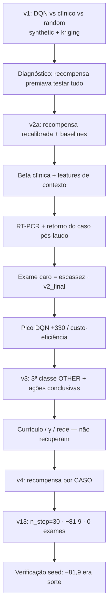

# Apresentação — 20/08/2026

**Dengue Diagnostics:** alocação de exames sob escassez, com aprendizagem por reforço  
Branch de trabalho: `krigin-env` · Fontes: `ACHADOS.md`, `RESULTS.md`, `RELATORIO_V4.md`, `REFATORACAO_AMBIENTE.md`

Este documento resume **o processo completo**, as **escolhas de desenho**, os **resultados** e o **estado atual**, de forma detalhada e cronológica. Números são reprodutíveis via configs em `experiments/configs/` (seeds fixas, benchmarks pareados).

---

## 0. Em uma página


| Tema                           | Situação                                                                                                                                                    |
| ------------------------------ | ----------------------------------------------------------------------------------------------------------------------------------------------------------- |
| **Problema**                   | Aprender *quando* e *em quem* gastar exame de laboratório para diagnosticar dengue na presença de chikungunya (e, depois, de não-arbovirose), sob escassez. |
| **Pico do DQN (binário, v2)**  | +330 vs `testonce` +739 — ~51% do caminho piso→teto; usa retorno pós-laudo corretamente; **melhor custo/acerto** entre quem testa.                          |
| **Ambiente atual (3 classes)** | Investigação sequencial genuína; melhores políticas fixas (`testtwice` ~+955) exigem cadeia de 2 exames + conclusão.                                        |
| **DQN no ambiente 3 classes**  | Nenhuma configuração estável supera as fixas. Melhor checkpoint isolado: `dqn_v13` (−81,9), **não reproduzível** ao trocar só o seed de treino (−3272).     |
| **Achado robusto**             | Em todas as execuções recentes o DQN faz **zero exames de lab**; usa `epi_confirm` ou colapsa em inação.                                                    |
| **Próximo passo**              | Protocolo multi-seed (≥3 treinos por config) antes de qualquer nova conclusão sobre hiperparâmetros ou crédito.                                             |


---


## 1. O problema e a premissa do trabalho

O ambiente `DengueDiag-v0` simula uma cidade com duas (depois três) epidemias. Para cada caso notificado, o agente escolhe ações de investigação ou conclusão. A **tese** do trabalho é alocar exames sob **escassez**: manter acurácia gastando menos testes do que “testar todo mundo”.

Isso só é um problema de decisão se:

1. testar tudo **não** for trivialmente ótimo;
2. a política ótima **depender do estado** (qualidade do médico, evidência espacial, laudo, etc.);
3. houver baselines fortes o bastante para mostrar que “aprender” supera regras fixas.

Grande parte do processo abaixo foi descobrir que o ambiente inicial **violava** (1) e (2), corrigir isso, e só então medir o agente com honestidade.

---


## 2. Linha do tempo do processo (visão geral)




| Fase         | Ambiente / experimento                             | O que se quis                             | Resultado-chave                                                |
| ------------ | -------------------------------------------------- | ----------------------------------------- | -------------------------------------------------------------- |
| **v1**       | Binário, exame barato, sem retorno                 | Benchmark inicial + generalização kriging | DQN > clínico (pareado); depois se viu que o ótimo era trivial |
| **v2a**      | Recompensa recalibrada                             | Ótimo depender do médico                  | `testall` deixa de ser campeão; `confirmall` vira barra        |
| **v2_final** | RT-PCR + retorno + `test_cost=7`                   | Escassez + fluxo realista                 | DQN +330; `testonce` +739; Q-Learning falha                    |
| **v3**       | + OTHER + Discrete(7)                              | Investigação sequencial real              | Políticas de 1 ação viram ruins; DQN não aprende a cadeia      |
| **v4/v5**    | `per_case_reward` (+ testes de n_step / lab_delay) | Creditar a decisão certa                  | Melhora parcial; instabilidade de treino domina                |


---


## 3. Fase v1 — primeiros resultados e o que eles *não* mostravam


### 3.1 Setup

- Mapa 400×400, ~150–280 casos, 60 dias, `reward_delay_days=5`
- DQN (Tianshou), `DengueNet` ~1,25 M parâmetros (após compressão de engenharia)
- Treino só em `synthetic`; teste também em `kriging` (Rio 2015–16)
- 10 seeds pareadas; métrica primária: **recompensa total**


### 3.2 Resultados (recompensa antiga)


| Ambiente  | Agente   | Recompensa | Acc. multiclasse | Testes/ep. |
| --------- | -------- | ---------- | ---------------- | ---------- |
| Synthetic | **dqn**  | **−395,9** | **0,753**        | 103,4      |
|           | clinical | −702,8     | 0,690            | 0          |
|           | random   | −2288,3    | 0,633            | 91         |
| Kriging   | **dqn**  | **−44,9**  | **0,782**        | 74,6       |
|           | clinical | −576,3     | 0,731            | 0          |
|           | random   | −2150,8    | 0,660            | 91         |


Pareado: DQN vence clínico em 8/10 seeds (recompensa) e 10/10 (acurácia); vence random em 10/10.

### 3.3 Escolhas e leituras que depois foram revistas


| Leitura inicial               | Correção posterior                                                                                  |
| ----------------------------- | --------------------------------------------------------------------------------------------------- |
| “DQN generaliza para kriging” | Parte da diferença synthetic×kriging era **ruído do médico** (correlação médico×recompensa ≈ +0,97) |
| “DQN é o melhor agente”       | Faltava o baseline trivial `testall` — que **superava** o DQN sob a recompensa v1                   |
| Meta de 90% de acurácia       | Com laudo 0,9/0,9 e 10% inconclusivo **e sem retorno**, teto ≈ **88%**                              |


Detalhe do confundidor espacial: para a mesma seed, a competência clínica é amostrada *antes* do mundo — idêntica em synthetic e kriging — e mesmo assim o clínico puro muda de acurácia (0,690 → 0,731). Logo a diferença **não** pode ser só espacialidade.

---


## 4. Diagnósticos que moldaram o desenho


### 4.1 A recompensa premiava testar tudo (crítico)

Com `testall` no benchmark (v1):


| Agente      | Recompensa | Acc.  | Testes |
| ----------- | ---------- | ----- | ------ |
| **testall** | **−35,5**  | 0,873 | 280    |
| dqn         | −395,9     | 0,753 | 103    |
| clinical    | −702,8     | 0,690 | 0      |


**Causa:** penalidade −10 só para erro **não testado**. Pedir exame virava “passe livre”, mesmo com laudo inconclusivo. Isso **contradizia** a premissa de alocação sob escassez.

**Escolha (recompensa v2):**


| Parâmetro                 | Antes | Depois   |
| ------------------------- | ----- | -------- |
| Erro (testado ou não)     | —     | **−3,0** |
| Extra por não ter testado | −10,0 | **0,0**  |


Efeito: ótimo **depende do médico** — testar quando ruim; confirmar quando bom. Margem oráculo vs melhor fixa ≈ +470 no cenário misto (justifica RL).

### 4.2 Teto de informação (~88% → depois >90%)

Restrições iniciais:

1. **Uma ação por caso** (sem segunda visita após laudo) → testa *ou* decide.
2. Laudo imperfeito (0,9 / 0,9 / 10% inconclusivo).

`acc_max ≈ 0,9·0,9 + 0,1·acc_clínica ≈ 0,88` — confirmado por `testall` (0,873 / 0,884).

**Escolhas posteriores para furar o teto:**

- parâmetros tipo RT-PCR;
- **retorno do caso** após o laudo (`max_case_revisits`).

Com ambas: acurácia de “testar todos” sobe para **~0,96**.

### 4.3 Qualidade clínica como confundidor

`clinical_specificity ~ U(0,5, 0,95)` fazia cada episódio um problema diferente. Com 10 seeds, o ruído dominava.

**Escolha:** modelo **Beta** para sensibilidade e especificidade, com níveis `low` / `medium` / `high` (e κ configurável).


| Nível  | sens. média | espec. média |
| ------ | ----------- | ------------ |
| low    | 0,60        | 0,60         |
| medium | 0,75        | 0,75         |
| high   | 0,90        | 0,90         |


**Lição metodológica:** níveis fixos são ótimos para **caracterizar** ambiente e baselines; o cenário **misto** é onde RL tem mais margem (inferir o médico). Com nível fixo, o oráculo quase empata com a melhor política fixa em medium/high.

### 4.4 Observabilidade do médico (context features)

Mesmo com nível médio fixo, a realização da Beta ainda varia. Para a mesma política fixa, a recompensa podia ir de −524 a +1550. O alvo de TD ficava ruidoso: variável latente **não observada**.

**Escolha:** expor na observação:

- taxa de concordância laudo × palpite clínico;
- força da evidência (nº de laudos informativos).

Validação: correlação estimativa×competência real **+0,991**. Efeito desejado: para calibrar o médico, o agente **precisa testar** no início (trade-off explorar/explorar).

### 4.5 Engenharia que viabilizou os experimentos


| Item                 | Antes   | Depois     |
| -------------------- | ------- | ---------- |
| Parâmetros da rede   | 69,4 M  | **1,25 M** |
| Checkpoint           | ~555 MB | **5 MB**   |
| Passos/s do ambiente | 20      | **134**    |
| RAM do treino        | 18,8 GB | **7,2 GB** |


Bugs de memória: grids float64 no `info` de cada transição; buffer de teste do Tianshou (~12,8 GB) silencioso. Correção permitiu buffer de treino maior e ~2× velocidade.

---


## 5. Ambiente v2_final — escassez e fluxo pós-laudo


### 5.1 Três escolhas juntas

1. **Lab RT-PCR** (configurável): sens. 0,95 · espec. 0,98 · inconclusivo 0,02
  *(pendência: ancorar valores em referência bibliográfica)*
2. **Caso retorna** após laudo para decisão explícita.
3. `test_cost = 7,0`, calibrado por varredura:


| Custo   | Melhor fixa | Episódios em que testar vence |
| ------- | ----------- | ----------------------------- |
| 1,0     | +2419       | 10/10                         |
| 5,0     | +1299       | 9/10                          |
| **7,0** | **+739**    | **5/10** ← equilíbrio         |
| 9,0     | +179        | 4/10                          |


Sem custo alto, “testar uma vez todo mundo” era quase sempre ótimo → **não havia alocação**.

Baselines ajustados: `testall` degenera (nunca confirma → retesta até o limite); barra correta passa a ser `testonce`.

### 5.2 Escala de recompensa no treino

Recompensa bruta por passo: desvio ≈21, faixa [−287, +121] → DQN divergia (+1019 → −7245 entre épocas).

**Escolha:** `RewardScaleWrapper` (`reward_scale` só no treino, p.ex. 0,05–0,10). Multiplicar por constante positiva **não muda** a política ótima; benchmark reporta escala original.

Efeito: divergência numérica some; DQN sobe de −2057 para **+330**.

### 5.3 Resultado central (v2_final, 10 seeds)


| Agente                     | Recompensa | Acc.      | Exames   | Custo/acerto |
| -------------------------- | ---------- | --------- | -------- | ------------ |
| **testonce** (melhor fixa) | **+739,2** | **0,960** | 280      | 1,037        |
| **DQN**                    | **+330,3** | 0,784     | **98,6** | **0,449**    |
| confirmall                 | +128,8     | 0,690     | 0        | —            |
| clinical                   | −95,2      | 0,690     | 0        | —            |
| qlearning                  | −1850,2    | 0,580     | 67       | 0,337        |
| random                     | −3031,8    | 0,593     | 133      | 0,668        |
| *[oráculo por episódio]*   | *+995*     | —         | —        | —            |


**Comportamento do DQN (medido):**


| Ação            | 1ª visita | Retorno pós-laudo |
| --------------- | --------- | ----------------- |
| confirmar       | 64,4%     | **100%**          |
| solicitar exame | 33,9%     | —                 |
| aguardar        | 1,7%      | —                 |
| descartar       | 0%        | 0%                |


Usa o mecanismo de retorno **como projetado**. Faz ~65% menos exames que `testonce` e sobe a acurácia de 0,690 → 0,784.

**Limitações honestas nesta fase:**

1. Ainda abaixo da melhor fixa (+330 vs +739).
2. Seleção pouco adaptativa: correlação médico × taxa de teste **+0,310** (quase constante 30–41%) — aprendeu *quanto* testar, não *quem*.
3. Q-Learning tabular: maldição da dimensionalidade (estados ainda crescendo no fim; 3237 estados).

---


## 6. Ambiente v3 — três classes e investigação sequencial


### 6.1 Por que mudar

No binário, um laudo negativo **implica** a outra doença → segundo exame quase redundante; ação “descartar” nunca é ótima (verdade nunca é OTHER) → 0% de uso.

**Escolha:** gerar também **não-arbovirose** (`other_prevalence`, tipicamente ~25%). Laudo negativo fica ambíguo; aprofundar ou descartar vira decisão legítima.

### 6.2 Espaço de ações redesenhado

`confirm`/`discard` → três conclusões explícitas:


| Ação                | Significado        |
| ------------------- | ------------------ |
| 4 `conclude_dengue` | “é dengue”         |
| 5 `conclude_chik`   | “é chik”           |
| 6 `conclude_other`  | “não é arbovirose” |


Espaço: `Discrete(6)` → `Discrete(7)`. Motivação medida: só com posição espacial já havia sinal (~0,68 de acc.), mas o agente **não podia** discordar do médico sem gastar exame. Com ações por classe, política “infere e conclui sem exame” passa de inviável a **+131 / acc 0,711**.

### 6.3 Por que o DQN piora exatamente aqui


| Política de **uma** decisão | v2         | v3        |
| --------------------------- | ---------- | --------- |
| confirmall                  | **+128,8** | **−1365** |
| clinical                    | −95        | −4037     |


No v2 havia atalho de uma ação **positivo**. No v3, esse atalho some; a única política fortemente positiva (`testtwice` ~+955) exige **cadeia** testar → testar → concluir certo, com atrasos. O DQN não descobriu essa cadeia de forma estável.

### 6.4 Tentativas estruturais (v8–v11) — todas insuficientes


| Versão | Ideia                         | Recompensa | Exames | Leitura                   |
| ------ | ----------------------------- | ---------- | ------ | ------------------------- |
| v8     | γ=0,999 (horizonte)           | −2910      | 76     | Engaja pouco              |
| v9     | Currículo v2→v3               | −3712      | **0**  | Colapso em inação         |
| v10    | Currículo + γ=0,99            | −2752      | 203    | Testa sem fechar bem      |
| v11    | Rede: mapa 128 + contexto 128 | −3717      | ~1     | Continua abaixo das fixas |


Correções de bugs reais no caminho (órfãos 35,7% → 3,8%):

- `epi_confirm` passou a agendar revisita;
- máscara força decisão na **última** apresentação do caso;
- contexto deixou de ser ~1% da entrada da cabeça Q.

**Conclusão da fase:** cada config converge para uma **degeneração diferente**; nenhuma se aproxima de `testtwice`.

### 6.5 Horizonte de desconto (lição para o artigo)

Episódios longos (~373 passos) com placar terminal: com γ=0,99, `γ^373 ≈ 0,024` — o sinal de “conclua seus casos” fica quase invisível. γ precisa ser escolhido em função do comprimento do episódio, não por convenção Atari.

---


## 7. Ambiente v4 — recompensa por caso


### 7.1 Diagnóstico medido

No `CaseByCaseWrapper`, decisões do mesmo dia devolviam **0** até o último caso; aí caía a soma do dia. Medido: **~90% da variância** da recompensa de um passo vinha de decisões de **outros** casos / dias anteriores.

### 7.2 Escolha

- Separar aplicar ação do caso × avançar o dia;
- `per_case_reward: true`;
- `reward_delay_days: 0` (mantendo `lab_delay_days`, que sustenta a sequência).

Efeito no sinal: passos com sinal útil 2,3% → 100%; desvio por passo 31 → 10; soma do episódio preservada. Bug adicional de vazamento em dias vazios encontrado e corrigido (métricas históricas de avaliação permanece válidas).

### 7.3 Resultados pós-refatoração


|                  | v11 (agregado) | v12 (por caso) | v13 (`n_step` 30) |
| ---------------- | -------------- | -------------- | ----------------- |
| Recompensa DQN   | −3717          | −1703          | **−81,9**         |
| Acc. multiclasse | 0,534          | 0,552          | **0,699**         |
| Exames           | ~1             | **0**          | **0**             |
| Posição          | 5º/7           | 4º/7           | **3º/7**          |


Benchmark v13 (10 seeds de **avaliação**):


| #   | Agente            | Recompensa | Acc.      | Exames |
| --- | ----------------- | ---------- | --------- | ------ |
| 1   | testtwice         | +955       | 0,938     | 746    |
| 2   | testonce          | +247       | 0,756     | 373    |
| 3   | **dqn_v13**       | **−82**    | **0,699** | **0**  |
| 4   | confirmall        | −1365      | 0,571     | 0      |
| …   | clinical / random | bem abaixo |           |        |


Política v13: ~66% `epi_confirm`, conclui dengue/chik sem lab; **0% exames**; **0% conclude_other**. Sensibilidade dengue ~0,93 (empatando `testtwice`) **sem gastar exame** — estratégia de evidência barata, não de alocação laboratorial.

### 7.4 O que *não* se sustenta (metodologia)


| Experimento     | Mudança         | Resultado | Status             |
| --------------- | --------------- | --------- | ------------------ |
| v13 seed 42     | `n_step` 5→30   | −81,9     | Checkpoint bom     |
| v14             | `n_step` 30→60  | −3766     | Colapso            |
| v15             | `lab_delay` 5→2 | −3401     | Exames continuam 0 |
| **v13 seed 43** | **só o seed**   | **−3272** | **Invalida n=1**   |


Hipótese “cadeia do laudo longa demais → por isso zero exames” foi **refutada** (v15: cadeia curta, ainda 0 exames).  
Hipótese “`n_step=30` causa o salto” ficou **não estabelecida** (seed 43 destrói o resultado).

**Achado robusto que sobra:** em todas as seis execuções (configs × seeds), **zero exames de laboratório**. Números de recompensa oscilam milhares de pontos; esse comportamento **não**.

---


## 8. Mapa de versões (treino / benchmark)


| Tag                    | Foco                         | Config típica                       |
| ---------------------- | ---------------------------- | ----------------------------------- |
| v1 / delay5            | Baseline inicial             | `dqn_delay5.yaml`, `benchmark.yaml` |
| v2 / v2_{low,med,high} | Recompensa + níveis clínicos | `dqn_v2*.yaml`                      |
| v3_context             | Features de contexto         | `dqn_v3_context.yaml`               |
| v4–v7                  | RT-PCR, custo, escala, γ     | `dqn_v4`…`v7`                       |
| v8–v11                 | 3 classes, currículo, rede   | `dqn_v8`…`v11`, `benchmark_v9`…     |
| v12                    | `per_case_reward`            | `dqn_v12`, `benchmark_v12`          |
| v13                    | `n_step=30`                  | `dqn_v13`, `benchmark_v13`          |
| v14                    | `n_step=60`                  | `dqn_v14`                           |
| v15                    | `lab_delay=2` (v5)           | `dqn_v15`, `synthetic_v5`           |


Agentes disponíveis no benchmark moderno: `clinical`, `random`, `confirmall`, `testonce`, `testtwice`, `qlearning`, `dqn` (+ `testall` legado/degenerado).

---


## 9. O que está implementado e validado no código


| Feature                       | Flag / parâmetro                                | Status                                      |
| ----------------------------- | ----------------------------------------------- | ------------------------------------------- |
| Lab RT-PCR configurável       | `lab_sensitivity/specificity/inconclusive_prob` | ✅ (citar literatura)                        |
| Retorno pós-laudo             | `max_case_revisits`                             | ✅                                           |
| 3ª classe OTHER               | `other_prevalence`                              | ✅                                           |
| Clínica Beta                  | `clinical_quality`                              | ✅                                           |
| Exame caro                    | `test_cost`                                     | ✅ (recalibrar se mudar episize/prevalência) |
| Ações conclusivas             | Discrete(7)                                     | ✅                                           |
| Máscara / decisão forçada     | `force_decision_after_tests`                    | ✅                                           |
| Context features              | `context_features: true`                        | ✅                                           |
| Escala só no treino           | `reward_scale`                                  | ✅                                           |
| Recompensa por caso           | `per_case_reward`                               | ✅                                           |
| Warm-start / currículo        | `train.init_from`                               | ✅ (funciona; não resolveu v3)               |
| Gerador kriging + superfícies | `build_kriging_surfaces`                        | ✅ (melhorias de mapa em aberto)             |


Suíte de testes: da ordem de **160+** passando na linha de refatoração.

---


## 10. Artigo — defasagens conhecidas


| No texto antigo                 | No código / evidência atual                                |
| ------------------------------- | ---------------------------------------------------------- |
| Recompensa +5/−15               | +10/−20/−30 + placar; depois v2/v3 com custos recalibrados |
| Buffer 50 000                   | 5 000–6 000                                                |
| “100 cenários”                  | Tabelas com 10 seeds (às vezes 15)                         |
| Sensib./especif. fixas 85%/60%  | Beta com níveis                                            |
| Sem baseline clínico / testonce | Vários baselines                                           |
| Sem kriging                     | Implementado e avaliado                                    |
| Tabela ~0,71 para todos         | Precisa ser refeita sob o regime atual                     |


Mistura de idiomas (Intro/Métodos EN, Resultados PT) também precisa de padronização.

---


## 11. Mensagens para a reunião (20/08)


### O que podemos afirmar com segurança

1. O ambiente **evoluiu de forma consciente**: de um ótimo trivial (“teste tudo”) para um problema de **alocação** e depois para **investigação sequencial em 3 classes**.
2. No regime binário com escassez (v2_final), o DQN **aprende o fluxo pós-laudo**, é **custo-eficiente**, mas **não supera** a melhor política fixa.
3. Q-Learning tabular **não escala** neste espaço de estados.
4. No regime 3 classes, políticas fixas bem desenhadas (`testtwice`) são a barra; o DQN **não as alcança de forma reproduzível**.
5. Variância de **treino** (seed) é hoje maior que vários efeitos de hiperparâmetro que medimos com n=1.
6. Comportamento estável do DQN recente: **não pede exame de laboratório**.


### O que *não* devemos afirmar ainda

- Que `n_step=30` é a causa do −81,9.
- Que encurtar `lab_delay` piora o problema de forma causal (só vimos um colapso de treino).
- Que o DQN “generaliza para kriging” sem controle do nível clínico e ≥30 seeds.


### Decisões / próximos passos sugeridos

1. **Protocolo multi-seed** (≥3 seeds de treino por configuração) antes de mais ablações.
2. Se atacar o zero-exames: candidatos em `REFATORACAO_AMBIENTE.md` §11.4 — crédito retroativo no passo do exame, shaping informacional, ou MDP por caso.
3. **Ancorar RT-PCR** em referência; decidir se capacidade diária finita (teto de exames/dia) entra no modelo.
4. **Atualizar o artigo** com o regime atual e baselines.
5. Kriging: detalhar o que melhorar na construção do mapa (ainda em aberto).

---


## 12. Como reproduzir (atalhos)

```bash
poetry install
poetry run pytest

# Pico histórico binário (v2_final) — treino + benchmark
poetry run python agents/deepq/train.py --config experiments/configs/train/dqn_v4.yaml
poetry run python experiments/evaluate.py --config experiments/configs/benchmark_v2_final.yaml

# Estado 3 classes + por caso (exemplo v13)
poetry run python agents/deepq/train.py --config experiments/configs/train/dqn_v13.yaml
poetry run python experiments/evaluate.py --config experiments/configs/benchmark_v13.yaml

# Verificação de instabilidade (mesma config, outro seed)
poetry run python agents/deepq/train.py --config experiments/configs/train/dqn_v13_seed43.yaml
```

Detalhe diário: `ACHADOS.md` · Handoff técnico da refatoração: `REFATORACAO_AMBIENTE.md` · Números v1: `RESULTS.md` · Relato v2/v4: `RELATORIO_V4.md`.

---

*Documento gerado para a apresentação de 20/08/2026. Consolida o processo até a verificação de seed do* `dqn_v13`*.*