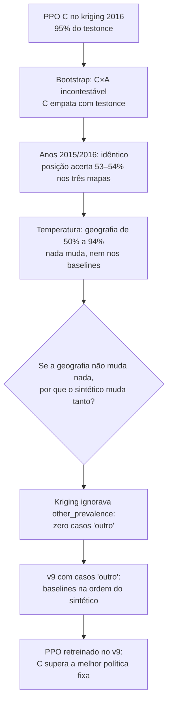

# Apresentação — 24/09/2026

**Dengue Diagnostics:** do resultado do PPO no kriging 2016 às comparações que o artigo precisa  
Branch de trabalho: `krigin-env` · Detalhes em `RESUMO_SESSAO.md` (§13–§18) e `Artigo/main.tex`

Este documento cobre só o que mudou **desde a sugestão do orientador**. Todo
número vem de benchmark com seeds fixas e pareadas (as mesmas 10 seeds de
avaliação, 100…550, para todos os agentes).

---

## 0. Em uma página


| Tema | Situação |
|---|---|
| **Ponto de partida** | PPO com crédito por caso a 95% da melhor política fixa, mas medido num único cenário: o kriging do Rio 2015-16. |
| **Pedido do orientador** | Clamping e desvios de uniforme; bootstrapping; robustez a diferentes cenários; synthetic-pop. |
| **Bootstrapping** | Feito. Intervalos de confiança hierárquicos e pareados. O efeito do crédito é incontestável: P(C > A) = 1,00. |
| **Robustez (ano, geografia)** | Feita sem retreino. O resultado se mantém entre anos e em toda a faixa de dificuldade espacial. |
| **Achado crítico** | O kriging **não tinha casos "outro"** (não-arbovirose). Era isso, e não a geografia, que fazia um único exame bastar. |
| **Ambiente corrigido (v9)** | O crédito por caso **supera** a melhor política fixa: +2387 contra +1225, mesma acurácia, 31% menos exames. |
| **Limitação principal** | O v9 tem 1 seed por braço. Faltam mais seeds, o baseline sequencial e os cenários de outras cidades (synthetic-pop). |


---

## 1. O que o orientador pediu, e como cada item foi lido


| Sugestão | Leitura adotada | Status |
|---|---|---|
| Métodos de clamping, desvios de uniforme | Um botão contínuo de **quanto a posição informa a doença**: temperatura, clamp por quantis e mistura com a uniforme sobre as superfícies do kriging. | Feito (§4). *Confirmar com o orientador se era essa a intenção.* |
| Bootstrapping | Intervalos de confiança por bootstrap **hierárquico** (seed de treino × episódio) e **pareado** entre braços. | Feito (§2) |
| Robustez a diferentes cenários | Outros anos, dificuldade espacial e, no caminho, a composição de casos. | Parcial (§3–§5) |
| synthetic-pop | População sintética do Censo 2022 com endereços (CNEFE) para outras cidades. | Pendente (§7) |





---

## 2. Bootstrapping: intervalos de confiança

**O que mudou no método.** Antes: média ± desvio entre 3 seeds. Agora
(`experiments/bootstrap.py`):

- reamostra **dois níveis**, as seeds de treino e os episódios de avaliação;
- os episódios são **pareados**: todo braço é avaliado nos mesmos surtos, com o
  mesmo médico. A comparação é feita episódio a episódio, o que remove a
  variância do surto;
- reporta média, IQM e **P(X > Y)**, a chance de X vencer Y no mesmo episódio
  (Agarwal et al. 2021).

**Resultado no kriging v8** (A e C com 4 seeds, B com 3):


| comparação | recompensa [IC 95%] | leitura |
|---|---|---|
| **C × A** (efeito do crédito) | **+2009** [+1197, +2882], **P = 1,00** | O C vence em todos os episódios, para todos os pares de seeds. |
| B × C (features temporais) | −43 [−196, +85], P = 0,47 | Empate: as features temporais não contribuem. |
| C × `testonce` | −90 [−250, +67] | Empate estatístico, com 23% menos exames e −2,2 pp de acurácia. |


Nas 12 seeds inéditas (9001+), C × A dá +1653, com P = 1,00.

O desvio de ±119 do braço A escondia o comportamento real: ele **desaba em
episódios específicos** (até −2200), e o C nunca desaba.

---

## 3. Robustez entre anos

Construímos as superfícies de kriging por ano, com opção nova no gerador para
anos diferentes por doença. A chikungunya praticamente não circulou em 2015
(70 notificações, contra 14 mil em 2016), então o cenário "2015" troca só a
dengue.


| | referência (2015+16) | dengue 2015 + chik 2016 | Rio 2016 |
|---|---|---|---|
| C | +2692 | +2710 | +2721 |
| C × A | +2009, P = 1,00 | +2077, P = 0,98 | +2022, P = 1,00 |


Os três dão o mesmo resultado, e isso era previsível: **a posição sozinha acerta
a doença em 53–54% nas três superfícies**. O ano muda um pouco onde os casos
estão, mas não quanto a posição revela. É consistência, não generalização, e
não vale gastar treino nesse eixo.

---

## 4. Clamping e desvios de uniforme: dificuldade espacial

A superfície do kriging é **quase plana**: a razão entre a célula mais e a
menos provável é só 8×. Por isso a posição informa tão pouco. Criamos três
botões (`surface_temperature`, `surface_clamp`, `surface_mix_uniform`) e uma
métrica sem ruído, a acurácia do melhor classificador que só vê a posição.


| τ (temperatura) | posição acerta | C | A | C × A |
|---|---|---|---|---|
| 0 (uniforme) | 0,50 | +2718 | +670 | +2047, P = 0,97 |
| 1 (treino) | 0,54 | +2692 | +691 | +2001, P = 1,00 |
| 8 | 0,74 | +2396 | +277 | +2119, P = 0,89 |
| 32 (nível do sintético) | 0,94 | +2686 | +541 | +2145, P = 0,95 |


- **A vantagem do crédito vale em toda a faixa.**
- Sem retreino, o C não aproveita a geografia mais informativa. Isso é
  esperado, e treinar nesses pontos é trabalho pendente.
- **A pergunta que abriu o achado seguinte:** se a posição acertando 94% não
  muda nada, por que o sintético (também 94%) muda tanto?

---

## 5. O achado crítico: o kriging não tinha casos "outro"

Na mesma seed, o sintético tinha 483 casos e o kriging, 360, com **exatamente
a mesma dengue e chik**. A diferença eram 123 casos de não-arbovirose.

- O gerador kriging **ignorava `other_prevalence` em silêncio**: o YAML
  declarava 25%, e o mundo gerava zero.
- Sem esses casos, **um laudo negativo de dengue implica chikungunya**: um
  exame sempre basta, e descartar nunca é correto.
- Todos os resultados no kriging até o v8 foram medidos nesse ambiente
  simplificado.

**A correção é o ambiente `kriging_v9`.** Os casos "outro" seguem o mesmo
modelo do sintético. O v8 continua reproduzível, e agora emite um aviso
quando `other_prevalence` é declarado sem a correção.


| baseline | kriging v8 | **kriging v9** | sintético |
|---|---|---|---|
| `testtwice` | +1051 | **+1225** | **+1249** |
| `testonce` | **+2782** | +322 | +473 |
| `clinical` (não agir) | −64 | −345 | −355 |
| `confirmall` | +346 | −1734 | −1821 |


Com os casos "outro", **a ordem dos baselines volta a ser a do sintético,
sem mudar a geografia**. A leitura anterior, de que "o sintético resolvia o
problema pela geografia", estava confundida por essa diferença.

Encontrado no caminho: as configs de ambiente nunca tinham sido versionadas,
porque a regra `env/` do `.gitignore` as pegava. Isso foi corrigido.

---

## 6. Resultado no ambiente corrigido (v9)

Os braços A e C foram retreinados no v9 com o mesmo treino do v4 (300 mil
passos) e **1 seed cada**, por falta de tempo.


| agente | recompensa [IC 95%] | acurácia | exames/episódio |
|---|---|---|---|
| **C (crédito por caso)** | **+2387** [+2186, +2564] | **0,938** | **675** |
| `testtwice` (melhor fixa) | +1225 [+1131, +1315] | 0,938 | 978 |
| `testonce` | +322 | 0,756 | 489 |
| `clinical` (não agir) | −345 | 0,576 | 0 |
| A (GAE padrão) | −1972 [−2897, −1028] | 0,563 | 6 |


- **C × `testtwice`: +1163 [+980, +1330], P = 1,00.** O C vence nos 10
  episódios, com a **mesma acurácia** e **31% menos exames**.
- No v8 o C apenas empatava com a melhor política fixa. No ambiente em que um
  exame não basta, ele a supera. Ele decide **quais** casos precisam do segundo
  exame, que é a competência que o ambiente foi desenhado para cobrar.
- **O GAE padrão colapsa:** o braço A pede cerca de 6 exames e fica abaixo de
  não agir. C × A dá +4359.
- **Ressalva:** com 1 seed, o IC cobre só a variação entre surtos. No v8 o
  desvio entre seeds foi ~50 no C e ~130 no A, muito abaixo das diferenças
  acima, mas isso não substitui mais seeds.

---

## 7. O que falta

**Sem treino (minutos):**
1. **Baseline fixo sequencial**: testar dengue e só testar chik se o laudo for
   negativo. É a política fixa natural entre `testonce` e `testtwice`, e o
   primeiro contra-argumento de um revisor.
2. **Quais casos o C testa duas vezes**: transforma "o C escolhe os casos
   certos" em medição e vira uma figura de interpretabilidade.
3. **Refazer no v9** o que foi medido no v8: seeds inéditas, anos, temperatura,
   robustez a médico, custo do exame e atraso do laudo.

**Com treino:**
4. **Mais seeds no v9** (≥ 4 por braço; ~3h30 por treino).
5. **Treinar A e C em pontos da curva de temperatura**: o crédito vence quando
   treinado em cada cenário? O agente aprende a usar a geografia quando ela
   informa?
6. **Outras cidades via synthetic-pop.** O repositório dá a população do Censo
   2022 com coordenadas de endereço, mas **não simula doença**: é preciso um
   modelo de atribuição de doença sobre a população. Também daria a densidade
   populacional que os casos "outro" deveriam seguir (hoje são uniformes).

**Para discutir com o orientador:**
- Se "desvios de uniforme" era a leitura espacial adotada no §4.
- Sazonalidade no SEIR (hoje não há forçamento sazonal).
- A premissa de R0 da chikungunya: as faixas de literatura se sobrepõem às da
  dengue.

---

## 8. Estado do artigo e do código

- **Artigo** (`Artigo/main.tex`, 27 páginas, compila): metodologia reescrita,
  resultados do v8 marcados como preliminares, seção do v9 e uma seção de
  pendências com marcadores `\todo{}`. Algumas referências do `.bib` estão
  marcadas para conferir.
- **Código**: 288 testes passando. Ferramentas novas:
  - `experiments/bootstrap.py`;
  - varreduras em `experiments/robustez.py`;
  - `transform_surfaces` e `kriging_other_cases` no gerador kriging.
- **Reproduzir o resultado principal:**

```bash
.venv/Scripts/python.exe -m agents.ppo.train --config experiments/configs/train/ppo_v5c_credito_s45.yaml
.venv/Scripts/python.exe -m experiments.evaluate --config experiments/configs/benchmark_ppo_v5c_credito_s45.yaml
.venv/Scripts/python.exe -m experiments.bootstrap benchmark_v9
```
